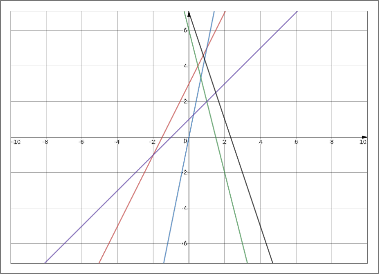

# 
 Design And Analysis of Algorithms   Project 

#### 
 Ayush Yadav (IMT2017009)   Prateksha U (IMT2017517) 

## Problem Statement
You are given equations of ​n​ lines as input. The equation of a line is of the form ​y=mx+c​ where ​m​ is the slope and ​c​ is the y-intercept. Design an ​O(n log n)algorithm that counts the number of intersection points that lie on the right side of the line x=0 (y-axis).

The following assumptions have been made:

- No line is parallel to the x-axis or y-axis.
- No two lines are parallel to each other.
- No three lines intersect at the same point. Hence, there are exactly ​n(n-1)/2 intersection points in the configuration.
- All the intersection points lie in the bounding box [-100,100]x[-100,100]. In other words, the x and y coordinates of any intersection point have an absolute value of atmost 100.

## Sources 
- Introduction to Algorithms by Thomas H. Cormen, Charles E. Leiserson, Ronald L. Rivest, and Clifford Stein
- Data Structures and Algorithms course codes

## Data Structures Used
We used 2-D Array for storing [ slope, y-intecept ] input.

## Example
*Number of equations = 5*
1.  y = 2x + 3
2.  y = 5x + 0
3.  y = -4x +6
4.  y = x + 1
5.  y= -3x + 7

## PSEUDO CODE

Input:  input_array consists of **n** [m,c] pairs.

~~~~
input_array.sort -> based on c values (y-intercept)
m_array = []

for 1 to n:
    m_array[i] = input_array[i][0] 

sort_and_count(m_array)
~~~~

A and B are two sorted lists. i, j are the pointers to the lists.

~~~~
merge_and_count (A, B)
    C = []
    count = 0
    while (A != empty and B!= empty)
        C.append( min(A[i], B[j])
        if( B[j]<A[i] )
            count += number of elements left in A
            j++
        else
            I++
        add the remaining elements to c

    return count, C
~~~~

With merge-and-count, we can design the count inversion algorithm as follows:

~~~~
sort_and_count (C)

    if ( C has one element)
        return 0
    else
        divide C into A and B
        (c1, A) = sort_and_count (A)
        (c2, B) = sort_and_count (B)
        (c3, C) = merge_and_count(A, B)

    return c1+c2+c3, C
~~~~
## Proof Of Correctness

Consider 2 equations .
1. y = m1x + c1
2. y = m2x + c2

Since no 2 lines are parallel to each other, Line 1 and Line 2 must intersect.

 m1x + c1  = m2x + c2   x = (c1 - c2)/(m2 - m1)

Since the intersection point has to lie on the right side of the line x = 0 ( y-axis ), we need to consider the case where the above relation is positive.

 i.e., (c1 - c2)/(m2 - m1) > 0  

For the above equation to be true, the values of c (y-intercept) and m (slope) have to satisfy one of the following conditions: 

 c1 > c2 AND m2 > m1            ---- (1)
  
 c1 < c2 AND m2 < m1 ----(2)

The above relation of intersection points can be reduced to a prolem of counting inversions as shown below.

The array of slopes say, M (i.e., [m1, m2,m3 ... mn]) is such that the corresponding c values are sorted (i.e., c1 < c2 < c3 ... cn)

We get an array such that, ∀ i, j ∈ indices of M. 

 i < j  ⇒ ci < cj ----(3)

and if,

 M[i] > M[j] ----(4)

we can say that the point of the intersection of the two lines is beyond the y-axis (from (1) and (2)). The above relations (3) and (4) show the reduction of the intersection points problem into the counting inversions problem.

Hence, counting the number of inversions in the M array will give us the number of intersection points on the right side of the y-axis.

- _**Claim 1**_ : *merge_and_count merges two given sorted arrays.*

    Let A[1, 2, 3 ... n] and B[1, 2, 3 ... n] be two sorted arrays and let C[1, 2, 3 ... 2n] be the final merged array.

    Proof by induction, (with induction being carried over the insertion of an element to C)

    **Base Case: i = 1**

    The first element of C, ie C[1] is the minimum of A[i] and B[i].

    Assume, for contradiction, minimum element isn’t min(A1[1] ,B[1]). 

    ∃ i>1 , such that either A[i] or B[i] is the minimum. Without loss of generailty assume A[i] is the minimum.

    but this means, A[i] < A[1] which is a contradiction to the assumption that both the arrays are sorted

    
    **Assuming it is true for all i = k-1**

    At the kth iteration C[k] is the minimum of A[p1] and B[p2].
    Where p1 and p2 are the pointers to the first element of A and B respectively that has not been added to C.

    Assume, for contradiction, minimum element isn’t the minimum of A[p1] and B[p2]. 
    ∃ i>p1 and j>p2, such that the minimum(A[i], B[j]) is the minimum and is added to C.
    Assume without loss of generailty let A[i] is the minimum.
            
    A[i] < A[p1] => contradiction to the assumption that the array A is sorted. 

    Hence, this assumption has been proved

- **__Claim 2__** : *merge_and_sort sorts the given array.*
    
    Proof by Strong Induction (induction on the size of the array):

    for an array of size i = 1 : trivially true (since an array of size 1 is already sorted).

    For the inductive step : assuming that merge_and_sort sorts every array of size less than n.

    Proving merge_and_sort on any array of size n.

    We know that merge_and_sort will recursively merge_and_sort on two arrays of size n/2. By the inductive hypothesis these two arrays are sorted correctly. From claim 1, we can say that the the two arrays are merged correctly from indices i = 1, 2, 3 ... n/2 and j = n/2 + 1, n/2+2, ... n and hence the array is sorted correctly.

- **__Claim 3__** : *when an inversion is observed, all elements in A which have not been added to C should be counted as inversions*

    When the algorithm compares Ai to Bj if Ai > Bj, then an inversion exists (since the *B* array is to the right of the *A* array and should have ∀i ∀j, j>i since j marks the indicies of the right half-array and i marks the indices for the left half-array).

    Since, we know that both arrays are sorted

    
 ∀ k>i,    Ai < Ak  

    
 also Bj < Ai  (given in the claim)

    this implies, 
    
 ∀ k>i and k < j,  Bj < Ak (k < j since j exists in the right array B which will having indicies greater than the largest index in A)

    Therefore all elements in A which have not been added to C are greater than than bj and thus need to be considered as inversions

- **__Claim 4__** : *merge_and_count counts every inversion atleast once*

    Suppose Z[i] > Z[j], in the array Z and i < j, i.e., there is an inversion in the original list.

    The function sort_and_count successively divides the array Z into half arrays A[1,2,3 ... n/2] and B[n/2, n/2+1, ... n], and merges them to give sorted arrays A ∪ B.

    Since we know from Claims 1 and 2, that the algorithm sorts the given array.

    At some point array A shall contain Z[i] and array B shall contain Z[j]. merge_and_count cannot exhaust all of A before Z[j] comes before Z[i] (since the array is being sorted) and hence is counted in the inversions.

- **__Claim 5__** : *merge_and_count does not count any inversion more than once.*

    An inversion pair *a*, *b* can only contribute to a count when *a* ∈ A and *b* ∈ B in some invocation of Merge-and-Count. Since A and B are merged during that invocation, this removes the inversion (by sorting the array) and hence the pair a, b can contribute to the count in exactly one invocation of Merge-and-Count. During that invocation when an inversion pair a, b does contribute to the count (claim 4), the inversion is **removed** since the final sorted array C, is used in the further invocations of merge_and_count.

 

## Analysis of Running Time

The Recurrence Relation for MergeSort is:

 T(n) = 2T(n/2) + n  
T(n) = 4T(n/4) + 2n  
T(n) = 8T(n/8) + 3n  
...  
T(n) = 2kT(n/2k) + kn  

Proof using Induction: 
For k=1: 
T(n) = 2T(n/2) + n is true.  

Induction hypothesis:  
T(n) = 2k-1T(n/2k-1) + (k-1)n  
T(n) = 2[2k-1T(n/2*2k-1) + (k-1)n/2] + n  
Hence proved, T(n) = 2kT(n/2k) + kn is true for all k.  

Put k = log(n):
T(n) = n(T(1)) + n log(n) = O(n log(n))

- Sorting the input based on **c** values (y-intercept) using TimSort(Default sorting algorithm in Python) - θ(n log(n))
- To count the inversions in **m** array (slopes array), the algorithm is a modified form of Merge Sort - θ(n log(n))
- Therefore the Time Complexity is θ(n log(n)) + θ(n log(n)).

 Time Complexity = θ(n log(n)) 

## Instructions on how to run the code
- The code is written in Python. The code can be run by using the following command for a given input file (Suppose the input file name is **input1.txt**)  -  **python IntersectionPoints.py TestCases/input1.txt**
- The **generate_input.py** generates random input values for a large value of **n**. The input values are written to the file **large_input.txt**. The value of **n** can be changed in the code to generate a different set of inputs.

## Individual Contributions

- **Combined Contribution** : Came up with the algorithm for the question.

- **Ayush** : Wrote the proof of correctness. Wrote sample test cases. Wrote the script for generating large inputs.

- **Prateksha** : Wrote the code. Completed pseudo code and the running time analysis of README.  Completed the README for TestCase formats.

